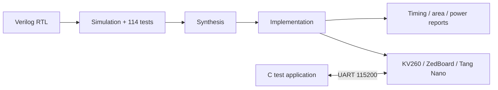

# FPGA Multiplier Architecture Optimization

**Timeline:** October 2025 – March 2026  
**Role:** Principal Investigator  
**Stack:** Verilog HDL, Vivado, QuestaSim, Quartus Prime, Embedded C, UART

## Objective

Design and experimentally compare signed 16-bit FPGA multiplier architectures across functionality, area, maximum frequency, latency, throughput, and estimated power.

## Implemented architectures

1. DSP-based multiplier baseline
2. Array multiplier
3. Sequential shift-and-add multiplier
4. Two-stage pipelined multiplier
5. Eight-stage pipelined multiplier
6. Sequential Booth radix-2 multiplier
7. Sequential Booth radix-4 multiplier
8. Two-core Booth radix-4 architecture
9. Eight-core Booth radix-4 architecture

## My contributions

- Led the project from architecture selection and RTL development through verification, implementation, multi-board testing, and final reporting.
- Developed reusable Verilog modules and testbenches for all nine architectures.
- Collected and compared LUT, FF, DSP, Fmax, latency, throughput, and power results.
- Designed a UART-based hardware-validation flow with automated C PASS/FAIL checking.
- Deployed selected designs on **Xilinx KV260, ZedBoard, and Tang Nano** boards.

## Selected results

| Result | Measurement |
|---|---:|
| Functional verification | **114/114 tests passed** |
| Array multiplier Fmax | 108.57 MHz |
| Two-stage pipeline Fmax | 503.78 MHz |
| Eight-stage pipeline Fmax | **725.16 MHz** |
| Pipeline speed improvement | Nearly **7×** over array baseline |
| Booth radix-2 latency | 16 cycles |
| Booth radix-4 latency | **8 cycles** |
| Eight-core throughput | **1 result/cycle** after parallelization |
| UART hardware validation | Stable at 115,200 baud |

The eight-stage pipeline produced the highest clock frequency. The two-stage design offered a more balanced frequency/latency trade-off. Booth radix-4 halved sequential latency relative to radix-2, while multi-core designs scaled throughput at the cost of area and dynamic power.

## Verification and deployment flow

## Key engineering takeaways

- No single multiplier architecture is optimal for every workload; latency, throughput, resource use, and power must be evaluated together.
- Deep pipelining improved Fmax substantially but added latency and registers.
- Booth radix-4 provided a practical speed/power balance for sequential multiplication.
- Board-level validation exposed integration concerns not visible in RTL simulation alone.

[Back to portfolio](../README.md)

