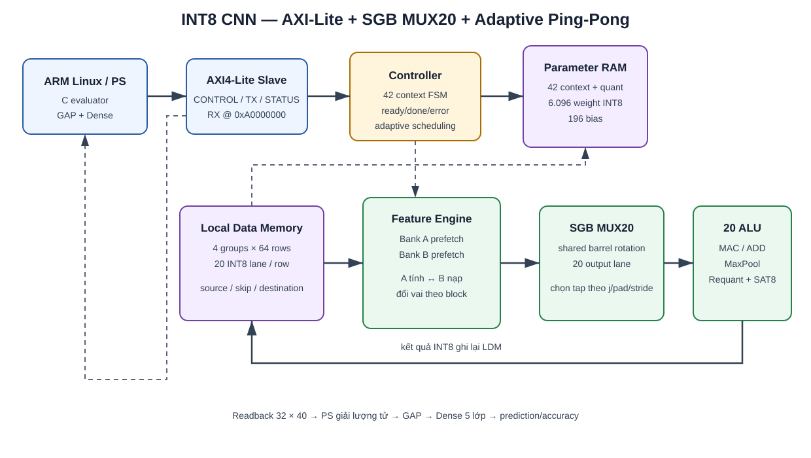
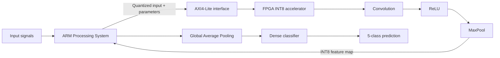

# INT8 1D-CNN AI Inference Accelerator on Xilinx KV260

**Timeline:** January 2026 – August 2026  
**Role:** FPGA/SoC AI Hardware Designer  
**Stack:** Verilog HDL, Xilinx Vivado, AXI4-Lite, Embedded C, Linux ARM64, Xilinx KV260

## Objective

Deploy a five-class 1D-CNN inference pipeline on an FPGA/SoC platform while replacing floating-point CNN computation with efficient signed INT8 arithmetic.

## System architecture

The FPGA executes the convolutional feature extractor, while the ARM processor controls the accelerator and performs the GAP/Dense classification tail.

## My contributions

- Mapped floating-point inference to signed INT8 using per-layer scale and zero-point parameters.
- Implemented fixed-point requantization, saturation, convolution, ReLU, and max-pooling in RTL.
- Designed **20 MAC lanes**, **5 requantization units**, and **42 execution contexts**.
- Developed AXI4-Lite control, parameter loading, configurable on-chip memories, result readback, and error/status reporting.
- Built a Linux ARM64 C application for model loading, inference control, readback, accuracy calculation, and confusion-matrix generation.
- Created unit tests, full-model RTL tests, bit-accurate golden models, and multi-sample validation flows.

## Measured results

| Metric | Result |
|---|---:|
| Board-level dataset evaluation | 15,009 samples |
| Correct classifications | 14,756 |
| Board-level accuracy | **98.31%** |
| RTL/golden validation | **10,240/10,240 outputs matched** |
| Target clock | 100 MHz |
| Worst negative slack | **+0.701 ns — timing met** |
| Inference latency | 21,437 cycles |
| Placed CLB LUTs | 17,530 — 14.97% |
| Placed CLB registers | 6,898 — 2.94% |
| DSP / BRAM | **0 / 0** |

## Verification strategy

1. Unit verification of the INT8 MAC, saturation, requantization, parameter loader, FIFO, and feature-multiplexing blocks.
2. Full-model execution across 42 contexts with 1,280 INT8 outputs per sample.
3. Bit-exact comparison against an integer golden model.
4. Prediction comparison against the quantized TFLite model.
5. End-to-end KV260 execution controlled by Linux ARM64 software through AXI4-Lite.

## Key engineering takeaways

- Quantization is a hardware/software contract: scale, zero-point, signedness, rounding, saturation, and padding must match the model exactly.
- Separating the FPGA feature extractor from the ARM classification tail kept the accelerator interface compact while supporting end-to-end evaluation.
- Bit-exact verification was essential before physical-board deployment and dataset-level accuracy testing.

[Back to portfolio](../README.md)
